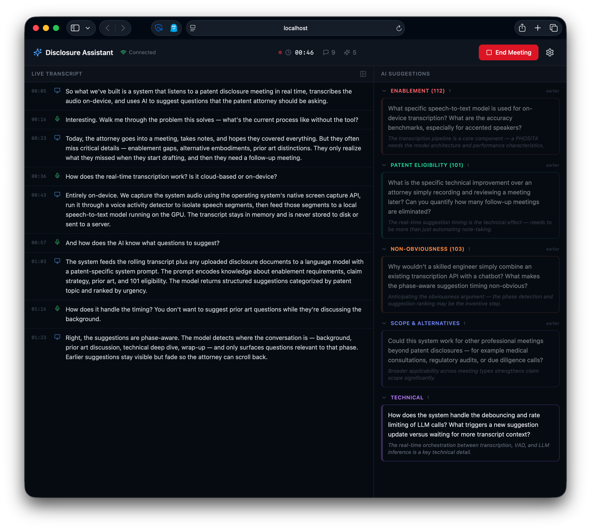
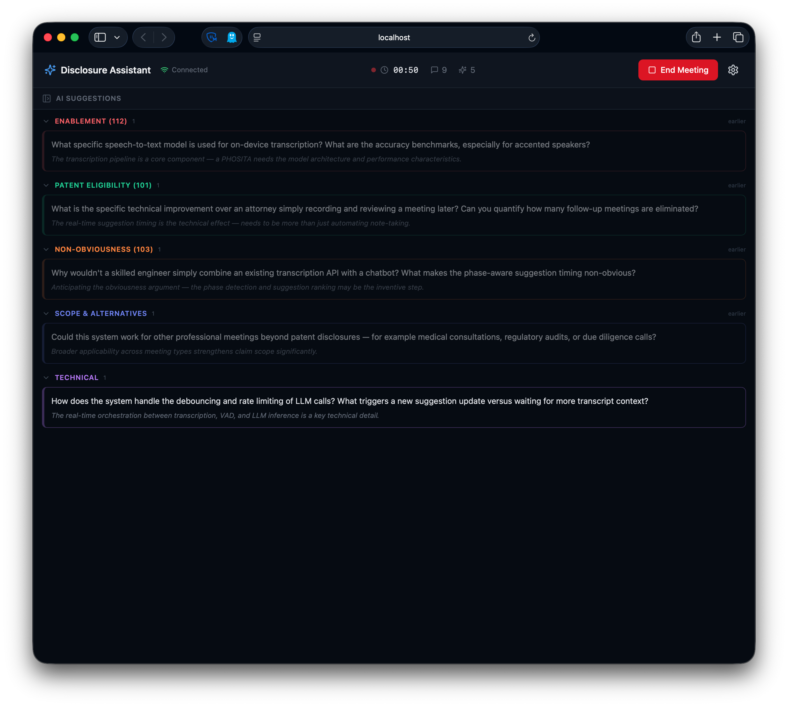

# Pat — AI Patent Disclosure Meeting Assistant

Pat is a real-time AI assistant for patent inventor disclosure meetings. Pat listens to the meeting, transcribes on-device, and provides live suggestions telling the patent attorney what questions to ask — before the conversation moves on.





## How Pat Works

1. **Before the meeting** — upload disclosure documents (PDF, DOCX, PPTX) to give Pat context. Pat analyzes them and generates a summary with top questions to ask.
2. **During the meeting** — Pat captures system audio from your meeting app (Zoom, Teams, Meet, etc.), transcribes in real time on-device with Whisper, and feeds the rolling transcript to an LLM.
3. **Live suggestions** — Pat provides phase-aware suggestions in a side panel, grouped by meeting stage (Background, Prior Art, Technical, Enablement). Suggestions auto-update as the conversation evolves. The transcript panel can be hidden for a full-width suggestion view.
4. **After the meeting** — Pat generates a summary of key details and follow-up questions, then discards the transcript from memory.

### What Pat Covers

Pat monitors the conversation and suggests questions across all areas critical to a strong patent application:

**Meeting Phase Awareness**
- **Background** — problem being solved, why existing approaches are insufficient
- **Prior Art** — existing solutions evaluated, their specific limitations
- **Technical** — architecture, components, algorithms, data flow

**35 USC 101 — Patent Eligibility**
- Technical effect and technical improvement achieved
- Practical application beyond abstract ideas
- Measurable technical benefits (speed, accuracy, resource usage)

**35 USC 112 — Enablement & Written Description**
- Details a PHOSITA needs to reproduce the invention
- Specific algorithms, parameters, thresholds, data formats
- Best mode — inventor's preferred implementation and why

**35 USC 102/103 — Novelty & Non-Obviousness**
- What specifically distinguishes this from prior art
- Unexpected results or counterintuitive aspects
- Why a PHOSITA wouldn't combine known approaches

**Scope & Alternative Embodiments**
- Other ways to achieve the same result
- Platform/domain limitations vs. broader applicability
- Components that could be swapped while keeping the core invention

**Examples, Figures & Edge Cases**
- Concrete examples with real inputs/outputs
- What should be illustrated (architecture, flowcharts, UI)
- Error handling, failures, fallback mechanisms

Suggestions are grouped by category and accumulate as the meeting progresses — earlier phase suggestions fade but remain accessible. Each suggestion can be dismissed individually.

### Pre-Meeting Analysis

Upload disclosure documents before the meeting and Pat generates:
- A plain-language **invention summary**
- **Top 3 questions** to ask, ranked by importance for the patent application
- These appear in the suggestion panel as a starting point when the meeting begins

## Architecture

```
React + TypeScript Frontend (Vite + TailwindCSS)
├── Live transcript panel (collapsible)
├── Phase-aware suggestion panel
├── Settings (LLM provider, audio sources, system prompt editor)
│
Python Backend (FastAPI + WebSocket)
├── Whisper large-v3 (on-device transcription, Metal acceleration)
├── Silero VAD (voice activity detection)
├── LLM suggestions via Anthropic-compatible API
│
Swift Audio Helper (ScreenCaptureKit)
└── Captures system audio — no custom drivers needed
```

### LLM Providers

Pat uses the **Anthropic messages API format** for both local and cloud:

- **LM Studio** (default) — runs any model locally at `localhost:1234` via Anthropic-compatible endpoint. Private, no data leaves your machine.
- **Claude API** (optional) — Anthropic's cloud API for best reasoning quality. Requires API key.

Same code, same prompt format — just different base URLs.

## Developer Setup

### Prerequisites

- macOS 13.0+ (Ventura) on Apple Silicon
- [Node.js 20+](https://nodejs.org/) and [pnpm](https://pnpm.io/)
- [uv](https://docs.astral.sh/uv/) (Python package manager)
- [LM Studio](https://lmstudio.ai/) (for local AI suggestions)
- Xcode Command Line Tools (`xcode-select --install`)

### Getting Started

```bash
# Clone
git clone https://github.com/LeonardHope/Pat-AI-Patent-Disclosure-Meeting-Assistant.git
cd Pat-AI-Patent-Disclosure-Meeting-Assistant

# Build the Swift audio helper
./scripts/build-audio-helper.sh

# Install Python dependencies
cd sidecar && uv sync && cd ..

# Install frontend dependencies
pnpm install

# Download Whisper model (~3GB)
./scripts/download-whisper-model.sh

# Start Pat
./scripts/dev.sh
```

### LLM Setup

**Local (default):** Open [LM Studio](https://lmstudio.ai/), download a model (e.g., Gemma 4, Qwen 3), load it, and start the local server on port 1234. Pat connects automatically.

**Cloud (optional):** Go to Settings in Pat, switch to "Claude API", and enter your Anthropic API key.

## Tech Stack

| Component | Technology |
|-----------|-----------|
| Frontend | React + TypeScript + Vite + TailwindCSS |
| Backend | Python 3.12 + FastAPI + WebSocket |
| Audio capture | Swift (ScreenCaptureKit) |
| Transcription | Whisper large-v3 (whisper.cpp, Metal) |
| VAD | Silero VAD |
| Local LLM | LM Studio (Anthropic-compatible API) |
| Cloud LLM | Claude API (optional) |
| State mgmt | Zustand |

## Privacy

- All transcription runs locally on-device (Whisper + Metal)
- With LM Studio, Pat's AI suggestions also run locally — nothing leaves your machine
- Transcripts are ephemeral (in-memory only, discarded when the meeting ends)
- No telemetry or analytics
- Claude API is opt-in with a clear privacy warning in settings

## Requirements

- macOS 13.0+ (Ventura or later)
- Apple Silicon (M1/M2/M3/M4)
- 16GB RAM minimum

## License

This project is **source-available**, not open source.

Licensed under the [PolyForm Noncommercial License 1.0.0 (Polyform-NC)](https://polyformproject.org/licenses/noncommercial/1.0.0/). You may view, use, and modify the code for personal, educational, and non-commercial purposes. Commercial use requires a separate license.

For commercial licensing inquiries, please open an issue on this repository.
